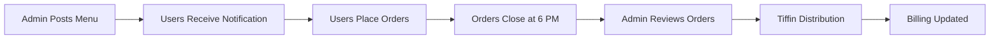

# 🍽️ Role-Based Meal Ordering & Management App

A comprehensive Flutter-based tiffin management ecosystem that automates meal ordering, billing, and administration for PG/hostel communities.

## 🎯 Overview

DasDaily eliminates the manual hassle of managing tiffin orders and billing in shared living spaces. What started as a WhatsApp group management headache is now a streamlined, automated system that handles everything from daily menu updates to monthly billing with QR code payments.

### Problem Solved
- **Before**: Manual WhatsApp updates, error-prone billing calculations, time-consuming distribution tracking
- **After**: Automated ordering system, real-time billing updates, seamless payment integration

### Key Statistics
- Supports 50+ users per day 
- Automated monthly billing cycle
- Real-time order synchronization
- 6 PM daily order cutoff automation

## ✨ Features

### 👨‍🍳 Admin App (dasdaily-admin)
- **Menu Management**: Daily menu updates with item descriptions
- **User Oversight**: Complete user list with tiffin counts and billing
- **Order Control**: Toggle ordering window (auto-closes at 6 PM)
- **Monthly Reports**: Generate and export monthly summaries
- **Real-time Sync**: Instant updates to user apps
- **Authentication**: Secure admin-only access

### 🍽️ User App (dasdaily-user)
- **Live Menu View**: Real-time menu updates from admin
- **Smart Ordering**: Select items and quantities before 6 PM cutoff
- **Bill Tracking**: Running total of monthly charges
- **Order History**: View past orders and billing details
- **QR Payments**: Generate QR codes for monthly bill settlement
- **Push Notifications**: Get notified of new menus and updates

### 🔄 Automated Features
- **Time-based Restrictions**: Orders automatically close at 6 PM
- **Monthly Reset**: Bills reset on 1st of each month
- **Historical Storage**: Previous month's data archived automatically
- **Real-time Updates**: Menu changes instantly reflect across all user apps
- **Notification System**: Users notified when new menus are posted

## 🛠️ Tech Stack

| Layer | Technology |
|-------|------------|
| **Frontend** | Flutter, Dart |
| **Backend** | Firebase Firestore |
| **Authentication** | Firebase Auth |
| **Real-time Sync** | Firestore Streams |
| **State Management** | Provider/Bloc Pattern |
| **Notifications** | Firebase Cloud Messaging |
| **Payments** | QR Code Generation |
| **UI/UX** | Material Design, Custom Animations |

## 🏗️ Architecture

```
DasDaily Ecosystem
│
├── 📱 dasdaily-admin/           # Admin Application
│   ├── lib/
│   │   ├── authentication/
│   │   │   ├── login_page.dart
│   │   │   ├── signup_page.dart
│   │   ├── widgets/
│   │   │   ├── custom_text_field.dart
│   │   │   ├── user_tile.dart
│   │   ├── screens/
│   │   │   ├── admin_dashboard.dart
│   │   │   ├── menu_manager.dart
│   │   │   ├── monthly_reports.dart
│   │   │   ├── orders_view.dart
│   │   │   └── user_management.dart
│   │   └── main.dart
│   └── pubspec.yaml
│
├── 📱 dasdaily-user/            # User Application
│   ├── lib/
│   │   ├── authentication/
│   │   │   ├── login_page.dart
│   │   │   ├── signup_page.dart
│   │   ├── services/
│   │   │   ├── firebase_service.dart
│   │   ├── screens/
│   │   │   ├── landing_page.dart
│   │   │   ├── order_confirmation_page.dart
│   │   │   ├── profile_page.dart
│   │   └── main.dart
│   └── pubspec.yaml
│
└── 🔥 Firebase Backend
    ├── Firestore Database
    ├── Authentication
    ├── Cloud Functions
    └── Cloud Messaging
```

## 🗄️ Database Structure

### Firestore Collections

```javascript
users (collection)
  └── userId (doc)
        ├── name
        ├── totalTiffins
        ├── totalCurries
        ├── totalBill
        ├── orders (subcollection)
              └── 2025-07-26 (doc)
                   ├── tiffin: 1
                   ├── curry: 0
                   ├── total: 70

menu (collection)
  └── 2025-07-26 (doc)
        ├── items: ["Paneer", "Dal", "Roti"]
        ├── timestamp
        ├── orderingOpen: true

history (collection)
  └── 2025-07 (doc)
        ├── userId1: {tiffins: 10, curries: 5, total: 850}
        ├── userId2: {...}

```

## 📦 Installation

### Prerequisites
- Flutter SDK (3.0+)
- Dart SDK (3.0+)
- Firebase CLI
- Android Studio / VS Code
- Git

### Setup Steps

1. **Clone the Repository**
   ```bash
   git clone https://github.com/tanmayyysachan/dasdaily.git
   cd dasdaily
   ```

2. **Firebase Configuration**
   ```bash
   # Install Firebase CLI
   npm install -g firebase-tools
   
   # Login to Firebase
   firebase login
   
   # Initialize Firebase project
   firebase init
   ```

3. **Admin App Setup**
   ```bash
   cd dasdaily_admin
   flutter pub get
   
   # Add Firebase configuration files
   # - android/app/google-services.json
   # - ios/Runner/GoogleService-Info.plist
   
   flutter run
   ```

4. **User App Setup**
   ```bash
   cd dasdaily_user
   flutter pub get
   
   # Add Firebase configuration files
   flutter run
   ```

## 📖 Usage

### For Administrators

1. **Login**: Use admin credentials to access the admin panel
2. **Update Menu**: 
   - Navigate to Menu Management
   - Add daily items with prices and descriptions
   - Set ordering window status
3. **Monitor Orders**: View real-time order updates from all users
4. **Generate Reports**: Create monthly billing summaries
5. **Manage Users**: Add/remove users, view their order history

### For Users

1. **Registration**: Sign up using email/phone number
2. **Browse Menu**: View today's menu posted by admin
3. **Place Orders**: 
   - Select items and quantities
   - Confirm order before 6 PM cutoff
4. **Track Billing**: Monitor monthly bill in real-time
5. **Make Payments**: Generate QR code for monthly payment

### Daily Workflow



### REST API Endpoints

| Method | Endpoint | Description |
|--------|----------|-------------|
| GET | `/api/menu/today` | Get today's menu |
| POST | `/api/orders/place` | Place a new order |
| GET | `/api/users/{id}/billing` | Get user billing info |
| POST | `/api/admin/menu/update` | Update daily menu |
| GET | `/api/admin/reports/monthly` | Generate monthly report |

## 🚀 Deployment

```bash
# Build APK
flutter build apk --release

# Build App Bundle
flutter build appbundle --release
```

## 🔒 Security Features

- **Role-based Authentication**: Admin and user role separation
- **Firestore Security Rules**: Database access control
- **Input Validation**: Comprehensive data sanitization
- **Time-based Restrictions**: Automated order window control
- **Audit Logging**: Track all administrative actions

## 🔄 Future Enhancements

- [ ] **Payment Gateway Integration**: UPI, card payments
- [ ] **Inventory Management**: Track ingredient availability
- [ ] **Rating System**: User feedback on meals
- [ ] **Dietary Preferences**: Veg/Non-veg, allergies

#### Developed By:
[Tanmay Sachan](https://github.com/tanmayyysachan)

## 📞 Support

For support, email tanmaysachan0005@gmail.com or create an issue on GitHub.

---

**Made with ❤️ for hassle-free tiffin management**
