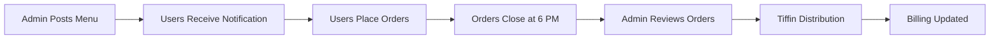

# 🍽️ DasDaily - Smart Tiffin Management System

A comprehensive Flutter-based tiffin management ecosystem that automates meal ordering, billing, and administration for PG/hostel communities.

## 📋 Table of Contents
- [Overview](#overview)
- [Features](#features)
- [Tech Stack](#tech-stack)
- [Architecture](#architecture)
- [Database Structure](#database-structure)
- [Installation](#installation)
- [Usage](#usage)
- [API Documentation](#api-documentation)
- [Contributing](#contributing)
- [License](#license)

## 🎯 Overview

DasDaily eliminates the manual hassle of managing tiffin orders and billing in shared living spaces. What started as a WhatsApp group management headache is now a streamlined, automated system that handles everything from daily menu updates to monthly billing with QR code payments.

### Problem Solved
- **Before**: Manual WhatsApp updates, error-prone billing calculations, time-consuming distribution tracking
- **After**: Automated ordering system, real-time billing updates, seamless payment integration

### Key Statistics
- Supports 50+ users per day 
- Automated monthly billing cycle
- Real-time order synchronization
- 6 PM daily order cutoff automation

## ✨ Features

### 👨‍🍳 Admin App (dasdaily-admin)
- **Menu Management**: Daily menu updates with item descriptions
- **User Oversight**: Complete user list with tiffin counts and billing
- **Order Control**: Toggle ordering window (auto-closes at 6 PM)
- **Monthly Reports**: Generate and export monthly summaries
- **Real-time Sync**: Instant updates to user apps
- **Authentication**: Secure admin-only access

### 🍽️ User App (dasdaily-user)
- **Live Menu View**: Real-time menu updates from admin
- **Smart Ordering**: Select items and quantities before 6 PM cutoff
- **Bill Tracking**: Running total of monthly charges
- **Order History**: View past orders and billing details
- **QR Payments**: Generate QR codes for monthly bill settlement
- **Push Notifications**: Get notified of new menus and updates

### 🔄 Automated Features
- **Time-based Restrictions**: Orders automatically close at 6 PM
- **Monthly Reset**: Bills reset on 1st of each month
- **Historical Storage**: Previous month's data archived automatically
- **Real-time Updates**: Menu changes instantly reflect across all user apps
- **Notification System**: Users notified when new menus are posted

## 🛠️ Tech Stack

| Layer | Technology |
|-------|------------|
| **Frontend** | Flutter, Dart |
| **Backend** | Firebase Firestore |
| **Authentication** | Firebase Auth |
| **Real-time Sync** | Firestore Streams |
| **State Management** | Provider/Bloc Pattern |
| **Notifications** | Firebase Cloud Messaging |
| **Payments** | QR Code Generation |
| **UI/UX** | Material Design, Custom Animations |

## 🏗️ Architecture

```
DasDaily Ecosystem
│
├── 📱 dasdaily-admin/           # Admin Application
│   ├── lib/
│   │   ├── screens/
│   │   │   ├── login_screen.dart
│   │   │   ├── menu_management.dart
│   │   │   ├── user_overview.dart
│   │   │   └── monthly_reports.dart
│   │   ├── services/
│   │   │   ├── firebase_service.dart
│   │   │   └── notification_service.dart
│   │   └── main.dart
│   └── pubspec.yaml
│
├── 📱 dasdaily-user/            # User Application
│   ├── lib/
│   │   ├── screens/
│   │   │   ├── login_screen.dart
│   │   │   ├── menu_screen.dart
│   │   │   ├── order_screen.dart
│   │   │   ├── billing_screen.dart
│   │   │   └── payment_screen.dart
│   │   ├── services/
│   │   │   ├── firebase_service.dart
│   │   │   └── payment_service.dart
│   │   └── main.dart
│   └── pubspec.yaml
│
└── 🔥 Firebase Backend
    ├── Firestore Database
    ├── Authentication
    ├── Cloud Functions
    └── Cloud Messaging
```

## 🗄️ Database Structure

### Firestore Collections

```javascript
// Users Collection
users: {
  userId: {
    name: "John Doe",
    email: "john@example.com",
    role: "user" | "admin",
    phoneNumber: "+91XXXXXXXXXX",
    totalTiffins: 15,
    totalCurries: 8,
    totalBill: 1290,
    createdAt: timestamp,
    lastOrderDate: "2025-07-28"
  }
}

// Daily Menu Collection
menu: {
  "2025-07-28": {
    items: [
      {
        name: "Paneer Butter Masala",
        type: "tiffin", // or "curry"
        price: 70,
        description: "Rich paneer curry with butter naan"
      }
    ],
    orderingOpen: true,
    postedBy: "adminUserId",
    postedAt: timestamp,
    cutoffTime: "18:00"
  }
}

// Orders Collection
orders: {
  userId: {
    "2025-07-28": {
      items: [
        {
          name: "Paneer Butter Masala",
          type: "tiffin",
          quantity: 1,
          price: 70
        }
      ],
      totalAmount: 70,
      orderTime: timestamp,
      status: "confirmed"
    }
  }
}

// Monthly History Collection
monthlyHistory: {
  "2025-07": {
    userId: {
      totalTiffins: 20,
      totalCurries: 5,
      totalAmount: 1550,
      orders: [...],
      billingStatus: "pending" | "paid",
      paymentDate: timestamp
    }
  }
}

// App Configuration
config: {
  settings: {
    tiffinPrice: 70,
    curryPrice: 30,
    orderCutoffTime: "18:00",
    monthlyResetDay: 1,
    notificationsEnabled: true
  }
}
```

## 📦 Installation

### Prerequisites
- Flutter SDK (3.0+)
- Dart SDK (3.0+)
- Firebase CLI
- Android Studio / VS Code
- Git

### Setup Steps

1. **Clone the Repository**
   ```bash
   git clone https://github.com/yourusername/dasdaily.git
   cd dasdaily
   ```

2. **Firebase Configuration**
   ```bash
   # Install Firebase CLI
   npm install -g firebase-tools
   
   # Login to Firebase
   firebase login
   
   # Initialize Firebase project
   firebase init
   ```

3. **Admin App Setup**
   ```bash
   cd dasdaily-admin
   flutter pub get
   
   # Add Firebase configuration files
   # - android/app/google-services.json
   # - ios/Runner/GoogleService-Info.plist
   
   flutter run
   ```

4. **User App Setup**
   ```bash
   cd dasdaily-user
   flutter pub get
   
   # Add Firebase configuration files
   flutter run
   ```

## 📖 Usage

### For Administrators

1. **Login**: Use admin credentials to access the admin panel
2. **Update Menu**: 
   - Navigate to Menu Management
   - Add daily items with prices and descriptions
   - Set ordering window status
3. **Monitor Orders**: View real-time order updates from all users
4. **Generate Reports**: Create monthly billing summaries
5. **Manage Users**: Add/remove users, view their order history

### For Users

1. **Registration**: Sign up using email/phone number
2. **Browse Menu**: View today's menu posted by admin
3. **Place Orders**: 
   - Select items and quantities
   - Confirm order before 6 PM cutoff
4. **Track Billing**: Monitor monthly bill in real-time
5. **Make Payments**: Generate QR code for monthly payment

### Daily Workflow



## 🔧 API Documentation

### Firebase Cloud Functions

#### Menu Management
```javascript
// Create/Update Daily Menu
exports.updateMenu = functions.https.onCall(async (data, context) => {
  // Validates admin role
  // Updates menu collection
  // Triggers user notifications
});

// Close Ordering Window
exports.closeOrdering = functions.pubsub.schedule('0 18 * * *')
  .onRun(async (context) => {
    // Automatically closes ordering at 6 PM
  });
```

#### Billing System
```javascript
// Calculate Monthly Bill
exports.calculateMonthlyBill = functions.firestore
  .document('orders/{userId}/{date}')
  .onCreate(async (snap, context) => {
    // Updates user's running total
    // Handles price calculations
  });

// Monthly Reset
exports.monthlyReset = functions.pubsub.schedule('0 0 1 * *')
  .onRun(async (context) => {
    // Archives previous month data
    // Resets current month totals
  });
```

### REST API Endpoints

| Method | Endpoint | Description |
|--------|----------|-------------|
| GET | `/api/menu/today` | Get today's menu |
| POST | `/api/orders/place` | Place a new order |
| GET | `/api/users/{id}/billing` | Get user billing info |
| POST | `/api/admin/menu/update` | Update daily menu |
| GET | `/api/admin/reports/monthly` | Generate monthly report |

## 🧪 Testing

### Unit Tests
```bash
# Run unit tests for both apps
cd dasdaily-admin && flutter test
cd dasdaily-user && flutter test
```

### Integration Tests
```bash
# Run integration tests
flutter drive --target=test_driver/app.dart
```

### Firebase Rules Testing
```bash
# Test Firestore security rules
firebase emulators:start
npm test
```

## 🚀 Deployment

### Android Deployment
```bash
# Build APK
flutter build apk --release

# Build App Bundle
flutter build appbundle --release
```

### iOS Deployment
```bash
# Build iOS app
flutter build ios --release
```

### Firebase Deployment
```bash
# Deploy cloud functions
firebase deploy --only functions

# Deploy Firestore rules
firebase deploy --only firestore:rules
```

## 🔒 Security Features

- **Role-based Authentication**: Admin and user role separation
- **Firestore Security Rules**: Database access control
- **Input Validation**: Comprehensive data sanitization
- **Time-based Restrictions**: Automated order window control
- **Audit Logging**: Track all administrative actions

## 🔄 Future Enhancements

- [ ] **Payment Gateway Integration**: UPI, card payments
- [ ] **Inventory Management**: Track ingredient availability
- [ ] **Rating System**: User feedback on meals
- [ ] **Dietary Preferences**: Veg/Non-veg, allergies

## 🤝 Contributing

1. Fork the repository
2. Create a feature branch (`git checkout -b feature/AmazingFeature`)
3. Commit your changes (`git commit -m 'Add some AmazingFeature'`)
4. Push to the branch (`git push origin feature/AmazingFeature`)
5. Open a Pull Request

#### Developed By:
[Tanmay](https://github.com/tanmayyysachan)

## 📞 Support

For support, email tanmaysachan0005@gmail.com or create an issue on GitHub.

---

**Made with ❤️ for hassle-free tiffin management**
